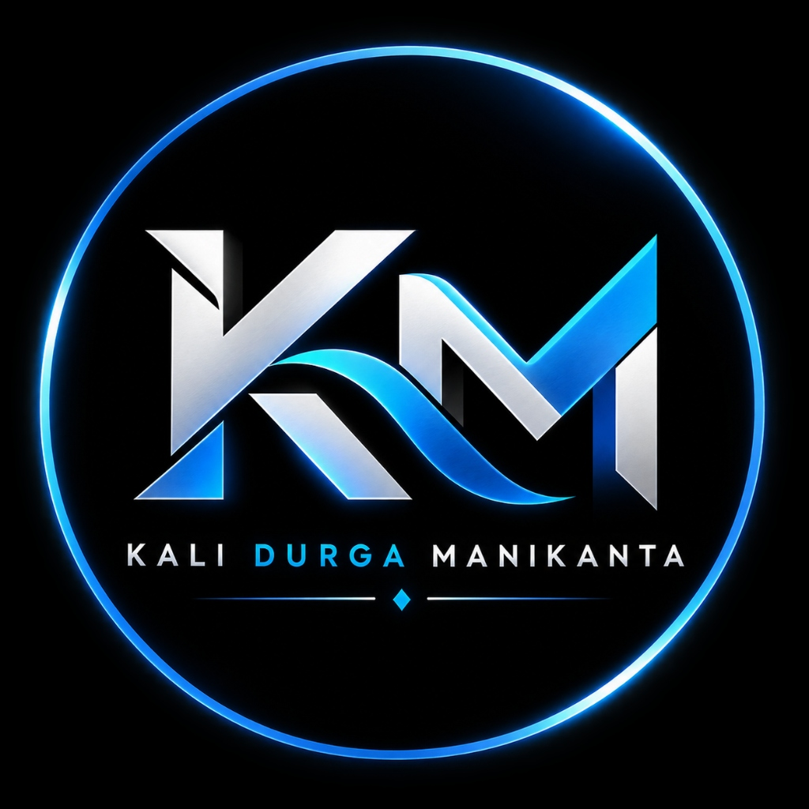

# 🎬 KALI DURGA MANIKANTA TECH PORTFOLIO

<p align="center">
  
</p>

<p align="center">
  <strong>Computer Science Engineering Student • Media Manager Head • Tech Innovator • Creative Designer & Editor</strong>
</p>

<p align="center">
  <a href="https://github.com/DurgaManikanta1319"></a>
  <a href="https://www.linkedin.com/in/kali-durga-manikanta/"></a>
  <a href="https://KaliDurgaManikanta.github.io"></a>
</p>

---

## 🌟 Overview

**KALI DURGA MANIKANTA TECH PORTFOLIO** is a state-of-the-art, cinematic Netflix-themed web experience crafted to showcase technical expertise, creative video editing, media management leadership, and innovative design projects.

Built with **React 19**, **Vite**, **GSAP animations**, and modern **Tailwind CSS**, this portfolio delivers fluid 60FPS motion, interactive 3D perspective cards, dynamic spotlight tracking, and responsive layout across all device viewports.

---

## 🚀 Key Features

- 🎭 **Netflix-Style Cinematic Preloader & Hero**: High-energy opening title sequence with authentic brand aesthetics and glowing logo.
- 🎯 **GSAP 3D Physics & Tilt**: Interactive 3D hover effects with real-time mouse-tracking spotlights and holographic glare.
- ⚡ **Ultra-Smooth Custom Cursor**: Dynamic cursor with ring tracking, magnetic hover states, and smooth physics.
- 📱 **Fully Responsive Layout**: Pixel-perfect presentation across mobile, tablet, and 4K ultra-wide monitors.
- 🎬 **Curated Project Showcase**: Netflix carousel-style cards highlighting real-world media projects, video editing reels, and leadership milestones.
- 📬 **Interactive Contact & Connect Suite**: Direct channels to get in touch for collaborations, freelance work, and technical roles.

---

## 🛠️ Tech Stack

| Domain | Technologies Used |
| :--- | :--- |
| **Frontend Framework** | [React 19](https://react.dev/) + [Vite](https://vitejs.dev/) |
| **Styling & Design** | [Tailwind CSS](https://tailwindcss.com/) + Custom Glassmorphism |
| **Animation & Physics** | [GSAP (GreenSock)](https://greensock.com/gsap/) + [Framer Motion](https://www.framer.com/motion/) + [AOS](https://michalsnik.github.io/aos/) |
| **Icons & Branding** | Custom Neon Glow Monogram & SVG Vector Assets |

---

## 📁 Project Structure

```text
Netflix_portfolio/
├── public/
│   ├── favicon.png             # Modern high-res PNG favicon
│   ├── favicon.svg             # Glowing neon vector SVG favicon
│   ├── logo.png                # Official Kali Durga Manikanta brand logo
│   └── icons.svg               # UI icons and sprite assets
├── src/
│   ├── assets/
│   │   ├── logo.png            # Imported logo asset
│   │   └── Portfolio/
│   │       └── picture.png     # Portrait artwork
│   ├── components/
│   │   ├── About.jsx           # Bio, background, and milestones
│   │   ├── Contact.jsx         # Contact form and direct links
│   │   ├── CustomCursor.jsx    # Smooth custom cursor physics
│   │   ├── Expertise.jsx       # Technical and creative disciplines
│   │   ├── Footer.jsx          # Brand footer and navigation
│   │   ├── Hero.jsx            # Hero section with 3D stage and navbar
│   │   ├── NetflixPreloader.jsx# Cinematic opening sequence
│   │   ├── Projects.jsx        # Project showcase
│   │   └── Skills.jsx          # Skills and tool proficiencies
│   ├── App.jsx                 # Main layout root
│   ├── App.css                 # Global styling overrides
│   └── main.jsx                # Application bootstrap
├── index.html                  # HTML5 template with SEO metadata & favicons
├── package.json                # Project dependencies & build scripts
└── vite.config.js              # Vite configuration
```

---

## 💻 Getting Started Locally

### Prerequisites
- **Node.js** (v18.0.0 or higher recommended)
- **npm** or **yarn** / **pnpm**

### Installation

1. **Clone the repository:**
   ```bash
   git clone https://github.com/DurgaManikanta1319/kali-durga-manikanta-tech-portfolio.git
   cd kali-durga-manikanta-tech-portfolio
   ```

2. **Install dependencies:**
   ```bash
   npm install
   ```

3. **Start the local development server:**
   ```bash
   npm run dev
   ```
   Open [http://localhost:5173](http://localhost:5173) in your browser to view the portfolio.

4. **Build for production:**
   ```bash
   npm run build
   ```
   The production-ready bundle will be generated inside the `dist/` directory.

---

## 🌐 Deployment Instructions

### Deploy on Vercel (Recommended)
```bash
npx vercel
```
- **Framework Preset**: `Vite`
- **Build Command**: `npm run build`
- **Output Directory**: `dist`

### Deploy on Netlify
```bash
npx netlify deploy --prod
```
- **Publish Directory**: `dist`

### Deploy on GitHub Pages
1. Push your code to your GitHub repository:
   ```bash
   git add .
   git commit -m "feat: Kali Durga Manikanta Tech Portfolio setup"
   git push -u origin main
   ```
2. In GitHub repository settings, go to **Settings > Pages** and select GitHub Actions or deploy from the `dist` branch.

---

## 📬 Contact & Connect

- **Name:** Kali Durga Manikanta
- **Institution:** SRM University-AP (Computer Science Engineering, 2024 - 2028)
- **LinkedIn:** [linkedin.com/in/kali-durga-manikanta](https://www.linkedin.com/in/kali-durga-manikanta/)
- **GitHub:** [github.com/DurgaManikanta1319](https://github.com/DurgaManikanta1319)
- **Portfolio:** [KaliDurgaManikanta.github.io](https://KaliDurgaManikanta.github.io)
- **Email:** [kdmvisuals@gmail.com](mailto:kdmvisuals@gmail.com)

---

<p align="center">
  <sub>© 2026 Kali Durga Manikanta. All Rights Reserved. Built with React & GSAP.</sub>
</p>
